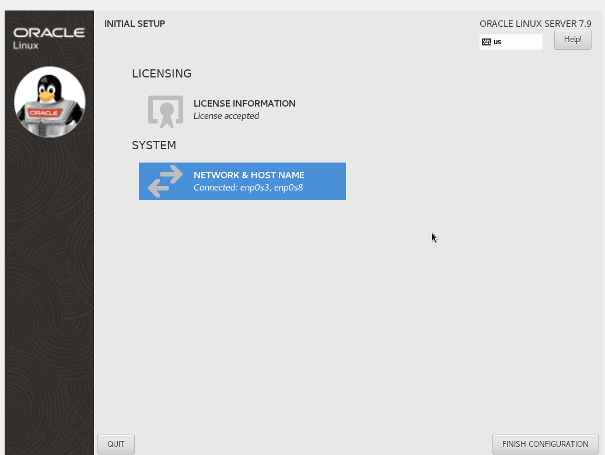
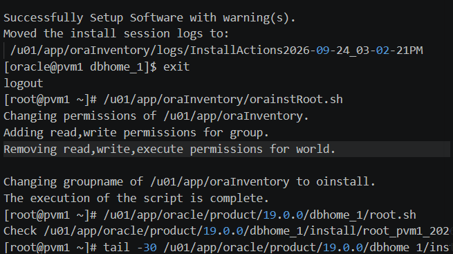
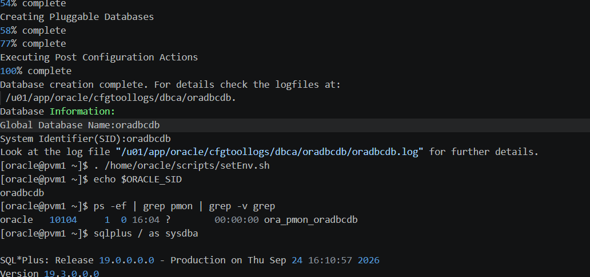
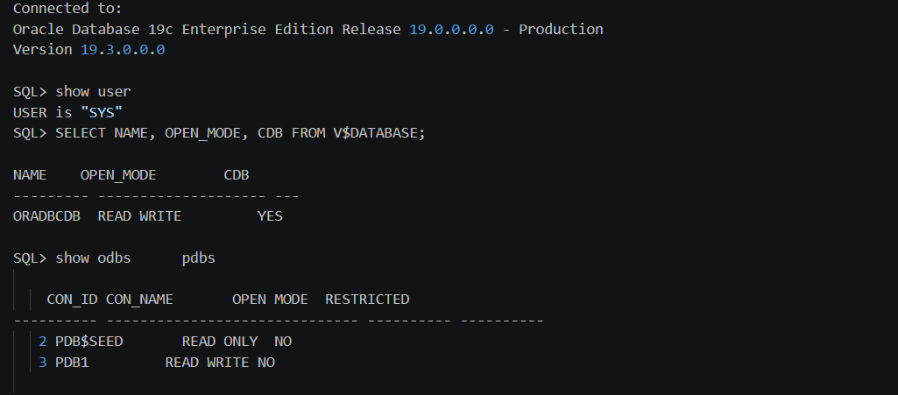
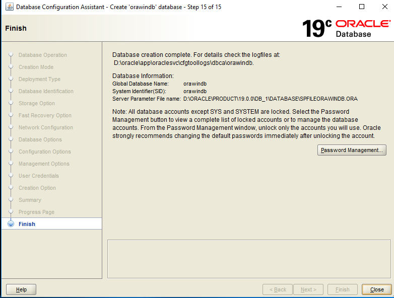
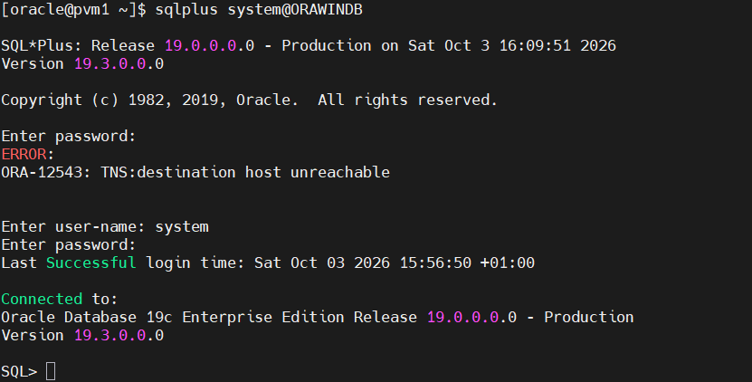
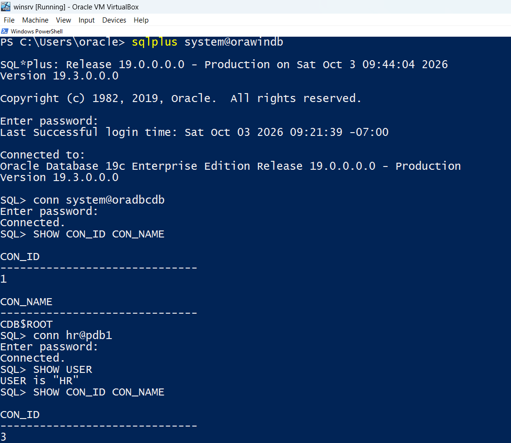

# Project 1: Cross-Platform Multitenant Infrastructure, Enterprise Security & Data Pipelines

## 1. Overview & Architecture

◆ **Client / Admin Node:** Windows Workstation (Remote Administrative Endpoint).

◆ **Database Server:** Oracle Linux 7.9 Virtual Machine.

◆ **Database:** Oracle Database 19c Enterprise Edition.

◆ **CDB:** ORADBCDB.

◆ **PDB:** PDB1.

◆ **Architecture Model:** $\text{Windows Client (Admin/Dev)} \iff \text{Oracle Linux 19c Server (CDB/PDBs)}$

### 1.1 Scenario & Workflow
This project involves deploying a multi-tier enterprise database architecture. The core database infrastructure (Container Database `oradbcdb` and Pluggable Databases `pdb1`, `pdb2`) resides on the Oracle Linux 19c server. Administrative tasks, security policy enforcement, data ingestion pipelines, and reporting operations are executed remotely from the Windows workstation using SQL*Plus, SQL Developer, SQL*Loader, and Data Pump.

---

## 2. Core Objectives
◆ Design and establish secure cross-platform connectivity between a Windows workstation and an Oracle Linux 19c server.

◆ Provision and configure Oracle 19c Container (CDB) and Pluggable Databases (PDBs) along with automatic storage and memory tuning (ASMM).

◆ Implement administrative lifecycle workflows for multitenant databases entirely from a remote client.

◆ Enforce enterprise security standards using common/local users, roles, password profiles, and secure authentication models.

◆ Build remote data pipelines using SQL*Loader, External Tables, and Data Pump across network links.

◆ Automate recurring database maintenance and statistics collection using `DBMS_SCHEDULER`.

---

## 3. Project Tasks Breakdown

### 3.1 Phase 1: Database Creation, Storage & Memory Architecture (1Z0-082)
◆ Install Oracle Database 19c software on Oracle Linux 7: Oracle Database 19c was installed on Oracle Linux 7 by following the [Oracle Database 19c Installation On Oracle Linux 7 (OL7)](https://oracle-base.com/articles/19c/oracle-db-19c-installation-on-oracle-linux-7) documentation. The complete execution log for the Oracle software installation and database creation process is available in the [Execution log](https://raw.githubusercontent.com/Mubarak-Monsuru/Oracle19c-Multitenant-Infrastructure-Project/refs/heads/main/logs/phase1_install.log). 

**Figure 1:** Oracle Linux Installation

**Figure 2:** Software Installation

◆ Create the Container Database (oradbcdb) and Pluggable Databases (PDB1, PDB2) using DBCA and SQL scripts: A multitenant database environment was created using Database Configuration Assistant (DBCA). The Container Database (CDB), oradbcdb, and the initial Pluggable Database (PDB), PDB1, were created during the database creation process.

**Figure 3:** Database Creation

**Figure 4:** CDB and PDB1

 A second Pluggable Database, PDB2, was subsequently created from the seed container, PDB$SEED, using a SQL script. PDB2 was configured with a dedicated administrator account and a maximum storage limit of 5 GB.

The SQL scripts used to create and configure the PDB are maintained in the project's [sql directory](https://github.com/Mubarak-Monsuru/Oracle19c-Multitenant-Infrastructure-Project/blob/main/sql/phase_1.sql).

◆ Configure Automatic Shared Memory Management (ASMM), tuning `SGA_TARGET` and `PGA_AGGREGATE_TARGET` parameters: Approximately 70% of the VM's 5.5 GB physical memory was designated for Oracle memory management. This allocation was divided approximately 60/40 between the SGA and PGA, resulting in an SGA_TARGET of 2368 MB and a PGA_AGGREGATE_TARGET of 1536 MB. MEMORY_TARGET and MEMORY_MAX_TARGET were set to 0 to use Automatic Shared Memory Management (ASMM). The [ASMM Log File](https://github.com/Mubarak-Monsuru/Oracle19c-Multitenant-Infrastructure-Project/blob/main/logs/phase1_asmm.log) contains the complete configuration steps and verification output.

### 3.2 Phase 2: Cross-Platform Networking & Connectivity Setup (1Z0-082)
◆ Install Oracle Database 19c Software and Create Oracle Database on a Windows VM: Installed Oracle Database 19c Enterprise Edition on the Windows administrator host (orawindb) to serve as a cross-platform client and remote database node. To enable seamless inter-node communication and hostname resolution across operating system boundaries without relying on DNS, static host mappings were configured in Oracle Linux and on the Windows workstation.

**Figure 5:** Successful Oracle Database 19c Installation & Instance Creation on Windows Admin Node

◆ Configure Server-Side Oracle Net Listener & Naming Methods (listener.ora, tnsnames.ora, sqlnet.ora): Utilized Oracle Network Configuration Assistant (netca) in silent/interactive mode on Oracle Linux to establish server-side network infrastructure. Configured listener.ora to register local database services on TCP/IP port 1521. Configured tnsnames.ora file to initiate connection via the local naming method. Configured sqlnet.ora to prioritize naming resolution using TNSNAMES and EZCONNECT (NAMES.DIRECTORY_PATH = (TNSNAMES, EZCONNECT)). Detailed execution output and parameter verification are recorded in the [Oracle Linux Network Configuration Log](https://github.com/Mubarak-Monsuru/Oracle19c-Multitenant-Infrastructure-Project/blob/main/logs/phase2_connectivity.log). 

◆ Configure Client-Side Network Descriptors for CDB and PDB Service Routing: Configured client-side Net Service Names inside the Windows workstation's [tnsnames.ora file](https://github.com/Mubarak-Monsuru/Oracle19c-Multitenant-Infrastructure-Project/blob/main/network-config/tnsnames.ora). TNS aliases were explicitly defined for the Container Database (oradbcdb) and Pluggable Databases (pdb1 and pdb2) on the remote Linux host using proper service registration descriptors. Updated the client's [sqlnet.ora file](https://github.com/Mubarak-Monsuru/Oracle19c-Multitenant-Infrastructure-Project/blob/main/network-config/sqlnet.ora) to allow local and easynaming connection methods.

◆ Validate Cross-Platform Inter-Database & Remote Client Connectivity via SQL*Plus: Verified end-to-end network connectivity and listener responsiveness between both operating systems. Executed SQL*Plus connection tests from Oracle Linux targeting the Windows database instance (orawindb), as well as remote connection tests from Windows to the primary Container Database (oradbcdb) and isolated Pluggable Databases (pdb1 and pdb2) on Oracle Linux.

**Figure 6:** Cross-Platform Connection from Oracle Linux to Windows Database Instance (orawindb)

**Figure 7:** Remote SQL*Plus Client Connection from Windows to Oracle Linux CDB/PDB Service

◆ Establish Database Links (`DBLINK`) between PDBs and execute remote cross-PDB queries.

### 3.3 Phase 3: Multitenant Lifecycle Operations (1Z0-082 & 1Z0-083)
- [ ] Perform remote PDB lifecycle operations from the Windows workstation:
  - [ ] Hot and cold cloning of `pdb1` into new test PDBs.
  - [ ] Unplugging a PDB to a `.pdb` / `.xml` manifest and plugging it into the CDB.
  - [ ] Dropping PDBs safely with datafiles.
  - [ ] Managing startup/shutdown states and setting `AUTOSTART` policies for PDBs.

### 3.4 Phase 4: Enterprise Security & Remote Authentication (1Z0-082)
- [ ] Implement Common Users (e.g., `C##admin`) and assign Common Roles across all PDBs.
- [ ] Create Local Users and assign granular Local Roles within specific PDBs.
- [ ] Design and enforce Password Profiles (failed login attempts, password lifetime, complexity rules).
- [ ] Configure Remote Password File authentication (`orapwd`) to allow secure remote `SYSDBA` access from Windows.
- [ ] Test and document OS-based authentication vs. password file authentication.

◆ Provision `BIGFILE` tablespaces, manage datafiles, and configure undo segments for multitenant isolation.

### 3.5 Phase 5: Remote Data Ingestion & Data Pipelines (1Z0-082)
- [ ] Prepare flat CSV data files on the Windows client workstation.
- [ ] Execute remote `SQLLDR` (SQL*Loader) from Windows to ingest data into target PDB tables.
- [ ] Define Oracle External Tables over staging files on the server for direct querying.
- [ ] Perform remote Data Pump exports (`expdp`) and imports (`impdp`) over Network Links between PDBs.

### 3.6 Phase 6: Automated Task Scheduling & Maintenance (1Z0-082)
- [ ] Create custom database jobs using `DBMS_SCHEDULER` to automate optimizer statistics gathering (`DBMS_STATS`).
- [ ] Configure automated maintenance windows and schedule log/purge routines.
- [ ] Verify job execution logs and monitor status via `DBA_SCHEDULER_JOBS` views.